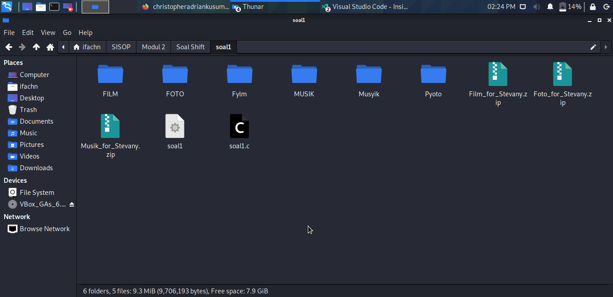
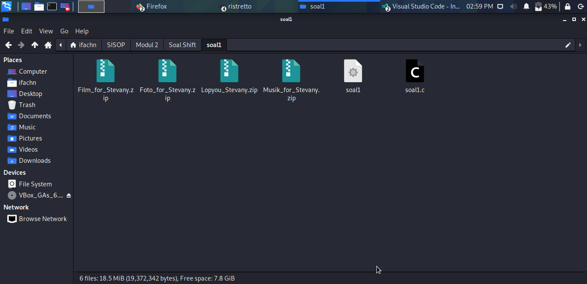
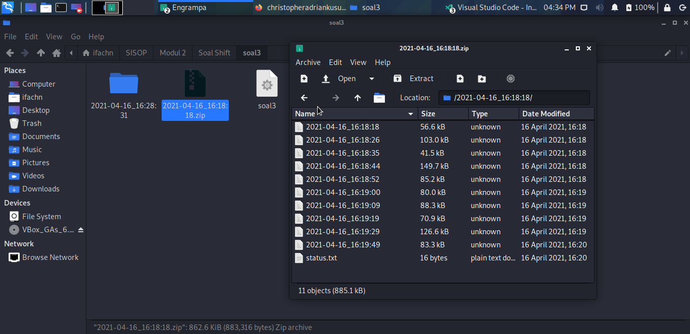
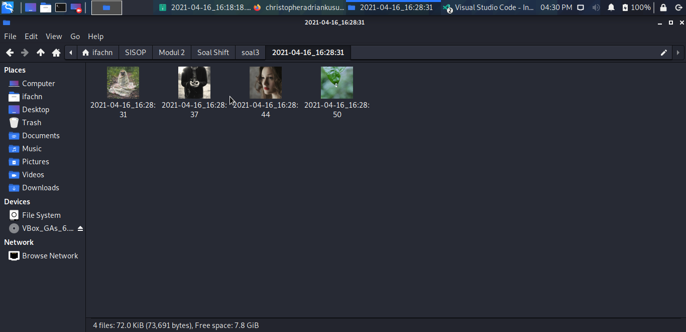
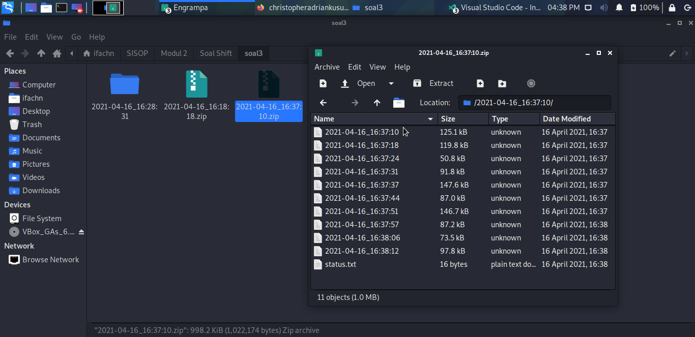
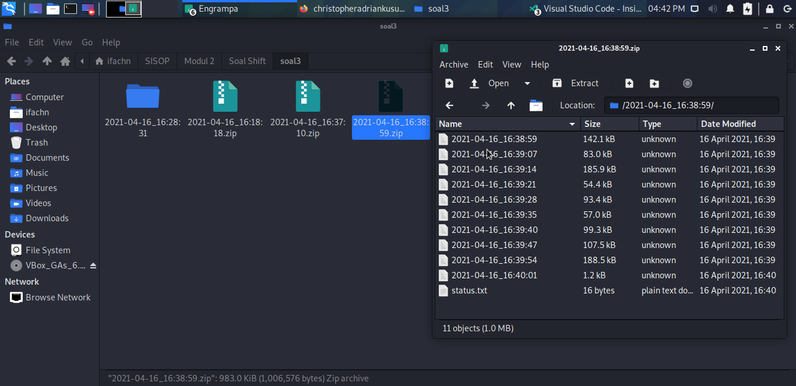

# soal-shift-sisop-modul-2-IT13-2021

### <b> Nama Anggota Kelompok: </b>
#### 1. Asiyah Hanifah (05311940000002)
#### 2. Muhammad Yasykur Rafii (05311940000017)
#### 3. Christopher Adrian Kusuma (05311940000022)
---

## Soal 1

Pada suatu masa, hiduplah seorang Steven yang hidupnya pas-pasan. Steven punya pacar, namun sudah putus sebelum pacaran. Ketika dia galau memikirkan mantan, ia selalu menonton https://www.youtube.com/watch?v=568DH_9CMKI untuk menghilangkan kesedihannya.</br>
</br>
Di lain hal Steven anak yang tidak amat sangat super membenci matkul sisop, beberapa jam setelah diputus oleh pacarnya dia menemukan wanita lain bernama Stevany, namun Stevany berkebalikan dengan Steven karena menyukai sisop. Steven ingin terlihat jago matkul sisop demi menarik perhatian Stevany. </br>
</br>
Pada hari ulang tahun Stevany, Steven ingin memberikan Stevany zip berisikan hal-hal yang disukai Stevany. Steven ingin isi zipnya menjadi rapi dengan membuat folder masing-masing sesuai extensi.

(a) Dikarenakan Stevany sangat menyukai huruf Y, Steven ingin nama folder-foldernya adalah Musyik untuk mp3, Fylm untuk mp4, dan Pyoto untuk jpg.

(b) untuk musik Steven mendownloadnya dari link di bawah, film dari link di bawah lagi, dan foto dari link dibawah juga :).

(c) Steven tidak ingin isi folder yang dibuatnya berisikan zip, sehingga perlu meng-extract-nya setelah didownload serta 

(d) memindahkannya ke dalam folder yang telah dibuat (hanya file yang dimasukkan).

(e) Untuk memudahkan Steven, ia ingin semua hal di atas berjalan otomatis 6 jam sebelum waktu ulang tahun Stevany). (f) Setelah itu pada waktu ulang tahunnya Stevany, semua folder akan di zip dengan nama Lopyu_Stevany.zip dan semua folder akan di delete(sehingga hanya menyisakan .zip).
Kemudian Steven meminta bantuanmu yang memang sudah jago sisop untuk membantunya mendapatkan hati Stevany. Bantu Woy!!

### <b>Note:</b>
- Ulang Tahun Stevany : 09 April Pukul 22.22 WIB
- Semua poin dijalankan oleh 1 script di latar belakang, termasuk mendownload file zip-nya. Jadi cukup jalankan script 1x serta ubah time dan date untuk check hasilnya.

> Preview:
https://drive.google.com/drive/folders/1NzRiPPoVlR_H8P51cxN4jaceeFQGk4un
- Tidak boleh menggunakan fungsi system(), mkdir(), dan rename() (Yang di bahasa C) .... FORBIDDENNN!!
- Tidak boleh pake cron !!!
- Menggunakan fork dan exec.
- Link

> Foto: https://drive.google.com/file/d/1FsrAzb9B5ixooGUs0dGiBr-rC7TS9wTD/view </br>
Musik: https://drive.google.com/file/d/1ZG8nRBRPquhYXq_sISdsVcXx5VdEgi-J/view </br>
Film: https://drive.google.com/file/d/1ktjGgDkL0nNpY-vT7rT7O6ZI47Ke9xcp/view </br>

### <b>Tips: </b>


- Gunakan fungsi wait() dan sleep() untuk memperlancarrr..
- untuk mendownload zip yang dibutuhkan bisa menggunakan command :
> wget --no-check-certificate "https://drive.google.com/uc?id=ID-FILE&export=download" -O Nama_untuk_filenya.ext

> Contoh: Wget --no-check-certificate "https://drive.google.com/uc?id=1ZG8nRBRPquhYXq_sISdsVcXx5VdEgi-J&export=download" -O Musik_for_Stevany.zip


## Penyelesaian:

### Code:
``` C
/*

Pyoto: FOTO: https://drive.google.com/uc?id=1FsrAzb9B5ixooGUs0dGiBr-rC7TS9wTD&export=download
Musyik: MUSIK: https://drive.google.com/uc?id=1ZG8nRBRPquhYXq_sISdsVcXx5VdEgi-J&export=download
Fylm: FILM: https://drive.google.com/uc?id=1ktjGgDkL0nNpY-vT7rT7O6ZI47Ke9xcp&export=download

*/

#include <sys/types.h>
#include <sys/stat.h>
#include <stdio.h>
#include <stdlib.h>
#include <fcntl.h>
#include <errno.h>
#include <unistd.h>
#include <string.h>
#include <time.h>
#include <wait.h>

// fungsi untuk mendowload foto, musik, dan video
void download(char *link, char *name) {
    pid_t child_id;
    child_id = fork();

    if (child_id == 0) {
        char *argv[6] = {
            "wget", //menggunakan wget untuk mengunduh file berbanyak
            "--no-check-certificate", 
            "-q",
            link, //menuju ke link yang akan didownload
            "-O",
            name
        };
        
        execv("/bin/wget", argv); //mengeksekusi dengan mendowloadnya
        exit(EXIT_SUCCESS);
    } else if (child_id > 0) {
        wait(NULL); //parentnya nunggu
    }
}


//untuk mengunzip file yang sudah didownload
void unzip(char *name) {
    pid_t child_id;
    child_id = fork();

    if (child_id == 0) {
        char *argv[3] = {
            "unzip", //menggunakan perintah unzip untuk mengekstrak zip yng sudah dibuat
            "-q",
            name
        };

        execv("/usr/bin/unzip", argv);
        exit(EXIT_SUCCESS);
    } else if (child_id > 0) {
        wait(NULL); //parentnya menunggu
    }
}

//mengcopy dalam folder yang diinginkan
void copy(char *name, char *target) {
    pid_t child_id;
    child_id = fork();

    if (child_id == 0) {
        char *argv[4] = { 
            "cp", //mengcopy 
            "-R",
            name,
            target
        };

        execv("/bin/cp", argv);
        exit(EXIT_SUCCESS);
    } else if (child_id > 0) {
        wait(NULL);
    }
}

//menzipkan semua folder yang sudah dibuat
void zip() {
    pid_t child_id;
    child_id = fork();

    if (child_id == 0) {
        char *argv[7] = {
            "zip", 
            "-q",
            "-r", 
            "Lopyou_Stevany.zip",
            "Pyoto", 
            "Musyik", 
            "Fylm"
        };

        execv("/bin/zip", argv);
        exit(EXIT_SUCCESS);
    } else if (child_id > 0) {
        wait(NULL);
    }
}

//fungsi mendelete semua folder dan menyisakan zip
void delete() {
    pid_t child_id;
    child_id = fork();

    if (child_id == 0) {
        char *argv[8] = {
            "rm",
            "-rf",
            "FOTO",
            "MUSIK",
            "FILM",
            "Pyoto", 
            "Musyik", 
            "Fylm"
        };

        execv("/bin/rm", argv);
        exit(EXIT_SUCCESS);
    } else if (child_id > 0) {
        wait(NULL);
    }

}

int main() {
    pid_t pid, sid;
	pid = fork();

	if (pid < 0) {
		exit(EXIT_FAILURE);
	}

	if (pid > 0) {
		exit(EXIT_SUCCESS);
	}

	umask(0);

	sid = setsid();
	if (sid < 0) {
		exit(EXIT_FAILURE);
	}

	if ((chdir("/home/kali/modul2")) < 0) {
		exit(EXIT_FAILURE);
	}

    // close(STDIN_FILENO);
	// close(STDOUT_FILENO);
	// close(STDERR_FILENO);

    char *link[3] = {
        "https://drive.google.com/uc?id=1FsrAzb9B5ixooGUs0dGiBr-rC7TS9wTD&export=download",
        "https://drive.google.com/uc?id=1ZG8nRBRPquhYXq_sISdsVcXx5VdEgi-J&export=download",
        "https://drive.google.com/uc?id=1ktjGgDkL0nNpY-vT7rT7O6ZI47Ke9xcp&export=download"
    };

    char *name[3] = {
        "Foto_for_Stevany.zip",
        "Musik_for_Stevany.zip",
        "Film_for_Stevany.zip"
    };

    struct tm bd = {0, 22, 22, 9, 3, 121};
    time_t birthday = mktime(&bd);

    while (1) {
        time_t now = time(NULL);
        double diff = difftime(birthday, now);
        if (diff > 0 && diff < 6*60*60) {
            download(link[0], name[0]);
            unzip(name[0]);
            copy("FOTO/", "Pyoto/");

            download(link[1], name[1]);
            unzip(name[1]);
            copy("MUSIK/", "Musyik/");

            download(link[2], name[2]);
            unzip(name[2]);
            copy("FILM/", "Fylm/");

            break;
        }
    }

    while(1) {
        time_t now = time(NULL);
        double diff = difftime(birthday, now);
        if (diff < 1 && diff > -1) {
            zip();

            delete();

            break;
        }
    }

    return 0;
}
```
### Penjelasan Code:
1. Membuat fungsi untuk mendownload file melalui link yang ditentukan sebagai berikut. Dimana di sini kami menggunakan wget dalam childenya untuk mengunduh file tersebut. Kemudian parentnya dibuat wait untuk menunggu beberapa saat agar child proses berjalan dulu.
```C
void download(char *link, char *name) {
    pid_t child_id;
    child_id = fork();

    if (child_id == 0) {
        char *argv[6] = {
            "wget", //menggunakan wget untuk mengunduh file berbanyak
            "--no-check-certificate", 
            "-q",
            link, //menuju ke link yang akan didownload
            "-O",
            name
        };
        
        execv("/bin/wget", argv); //mengeksekusi dengan mendowloadnya
        exit(EXIT_SUCCESS);
    } else if (child_id > 0) {
        wait(NULL); 
    }
}
```
2. Membuat fungsi untuk mengekstrak semua file yang sudah di download sebagai berikut. Di dalam fungsi ini kami menggunakan unzip untuk mengekstrak file yang sudah didownload. Parent pada fungsi ini kami buat menunggu sementara seperti fungsi sebelumnya agar child menjalankan prosesnya terlebih dahulu.
```C
void unzip(char *name) {
    pid_t child_id;
    child_id = fork();

    if (child_id == 0) {
        char *argv[3] = {
            "unzip", 
            "-q",
            name
        };

        execv("/usr/bin/unzip", argv);
        exit(EXIT_SUCCESS);
    } else if (child_id > 0) {
        wait(NULL); 
    }
}
```
3. Membuat fungsi copy untuk memindahkan file yang sudah diekstrak. Dengan cara mengcopy file Contohnya: dari folder Musik ke Musyik.
```C
void copy(char *name, char *target) {
    pid_t child_id;
    child_id = fork();

    if (child_id == 0) {
        char *argv[4] = { 
            "cp", //mengcopy 
            "-R",
            name,
            target
        };

        execv("/bin/cp", argv);
        exit(EXIT_SUCCESS);
    } else if (child_id > 0) {
        wait(NULL);
    }
}
```

4. Membuat fungsi zip untuk menjadikan semua folder tersebut dalam bentuk zip dan merenamenya dengan format nama Lopyou_Stevany.zip.
```C
void zip() {
    pid_t child_id;
    child_id = fork();

    if (child_id == 0) {
        char *argv[7] = {
            "zip", 
            "-q",
            "-r", 
            "Lopyou_Stevany.zip",
            "Pyoto", 
            "Musyik", 
            "Fylm"
        };

        execv("/bin/zip", argv);
        exit(EXIT_SUCCESS);
    } else if (child_id > 0) {
        wait(NULL);
    }
}
```

## Kendala yang Dihadapi: 
tidak ada.

## Screeshoot Hasil:

1. Mendownload file yang diinginkan kemudian meng-extract-nya setelah didownload. Setelah itu memindahkannya ke dalam folder yang telah dibuat kemudian menjadikannya dalam bentuk zip kemudian merename masing2 folder tersebut dengan nama (film/foto/musik)_for_Stevany


2. Kemudian semua folder di zip dengan nama Lopyu_Stevany.zip dan semua folder akan di delete(sehingga hanya menyisakan .zip)



---

## Soal 2

Loba bekerja di sebuah petshop terkenal, suatu saat dia mendapatkan zip yang berisi banyak sekali foto peliharaan dan Ia diperintahkan untuk mengkategorikan foto-foto peliharaan tersebut. Loba merasa kesusahan melakukan pekerjaanya secara manual, apalagi ada kemungkinan ia akan diperintahkan untuk melakukan hal yang sama. Kamu adalah teman baik Loba dan Ia meminta bantuanmu untuk membantu pekerjaannya.

(a) Pertama-tama program perlu mengextract zip yang diberikan ke dalam folder “/home/[user]/modul2/petshop”. Karena bos Loba teledor, dalam zip tersebut bisa berisi folder-folder yang tidak penting, maka program harus bisa membedakan file dan folder sehingga dapat memproses file yang seharusnya dikerjakan dan menghapus folder-folder yang tidak dibutuhkan.

(b) Foto peliharaan perlu dikategorikan sesuai jenis peliharaan, maka kamu harus membuat folder untuk setiap jenis peliharaan yang ada dalam zip. Karena kamu tidak mungkin memeriksa satu-persatu, maka program harus membuatkan folder-folder yang dibutuhkan sesuai dengan isi zip.
Contoh: Jenis peliharaan kucing akan disimpan dalam “/petshop/cat”, jenis peliharaan kura-kura akan disimpan dalam “/petshop/turtle”.

(c) Setelah folder kategori berhasil dibuat, programmu akan memindahkan foto ke folder dengan kategori yang sesuai dan di rename dengan nama peliharaan. Contoh: “/petshop/cat/joni.jpg”.

(d) Karena dalam satu foto bisa terdapat lebih dari satu peliharaan maka foto harus di pindah ke masing-masing kategori yang sesuai. Contoh: foto dengan nama “dog;baro;1_cat;joni;2.jpg” dipindah ke folder “/petshop/cat/joni.jpg” dan “/petshop/dog/baro.jpg”

(e) Di setiap folder buatlah sebuah file "keterangan.txt" yang berisi nama dan umur semua peliharaan dalam folder tersebut. <b>Format harus sesuai contoh.</b>

> nama : joni </br>
umur  : 3 tahun </br>
>nama : miko </br>
umur  : 2 tahun </br>

Loba sangat mengapresiasi bantuanmu, minggu depan ia akan mentraktir makan malam! 

### <b>Note: </b>

- Setiap data peliharaan disimpan sebagai nama foto dengan format [jenis peliharaan]:[nama peliharaan]:[umur peliharaan dalam tahun]. Jika terdapat lebih dari satu peliharaan, data dipisahkan menggunakan underscore(_).
- Tidak boleh menggunakan fungsi system(), mkdir(), dan rename().
- Menggunakan fork dan exec.


## Penyelesaian:

ya gtu blm

## Kendala yang Dihadapi: 
ini kendala

## Screeshoot Hasil:


---

## Soal 3

Ranora adalah mahasiswa Teknik Informatika yang saat ini sedang menjalani magang di perusahan ternama yang bernama “FakeKos Corp.”, perusahaan yang bergerak dibidang keamanan data. Karena Ranora masih magang, maka beban tugasnya tidak sebesar beban tugas pekerja tetap perusahaan. Di hari pertama Ranora bekerja, pembimbing magang Ranora memberi tugas pertamanya untuk membuat sebuah program.

(a) Ranora harus membuat sebuah program C yang dimana setiap 40 detik membuat sebuah direktori dengan nama sesuai timestamp [YYYY-mm-dd_HH:ii:ss].

(b) Setiap direktori yang sudah dibuat diisi dengan 10 gambar yang didownload dari https://picsum.photos/, dimana setiap gambar akan didownload setiap 5 detik. Setiap gambar yang didownload akan diberi nama dengan format timestamp [YYYY-mm-dd_HH:ii:ss] dan gambar tersebut berbentuk persegi dengan ukuran (n%1000) + 50 pixel dimana n adalah detik Epoch Unix.

(c) Setelah direktori telah terisi dengan 10 gambar, program tersebut akan membuat sebuah file “status.txt”, dimana didalamnya berisi pesan “Download Success” yang terenkripsi dengan teknik Caesar Cipher dan dengan shift 5. Caesar Cipher adalah Teknik enkripsi sederhana yang dimana dapat melakukan enkripsi string sesuai dengan shift/key yang kita tentukan. Misal huruf “A” akan dienkripsi dengan shift 4 maka akan menjadi “E”. Karena Ranora orangnya perfeksionis dan rapi, dia ingin setelah file tersebut dibuat, direktori akan di zip dan direktori akan didelete, sehingga menyisakan hanya file zip saja.

(d) Untuk mempermudah pengendalian program, pembimbing magang Ranora ingin program tersebut akan men-generate sebuah program “Killer” yang executable, dimana program tersebut akan menterminasi semua proses program yang sedang berjalan dan akan menghapus dirinya sendiri setelah program dijalankan. Karena Ranora menyukai sesuatu hal yang baru, maka Ranora memiliki ide untuk program “Killer” yang dibuat nantinya harus merupakan program bash.

(e) Pembimbing magang Ranora juga ingin nantinya program utama yang dibuat Ranora dapat dijalankan di dalam dua mode. Untuk mengaktifkan mode pertama, program harus dijalankan dengan argumen -z, dan Ketika dijalankan dalam mode pertama, program utama akan langsung menghentikan semua operasinya Ketika program Killer dijalankan. Sedangkan untuk mengaktifkan mode kedua, program harus dijalankan dengan argumen -x, dan Ketika dijalankan dalam mode kedua, program utama akan berhenti namun membiarkan proses di setiap direktori yang masih berjalan hingga selesai (Direktori yang sudah dibuat akan mendownload gambar sampai selesai dan membuat file txt, lalu zip dan delete direktori).

Ranora meminta bantuanmu untuk membantunya dalam membuat program tersebut. Karena kamu anak baik dan rajin menabung, bantulah Ranora dalam membuat program tersebut!

### <b>Note: </b>

- Tidak boleh menggunakan system() dan mkdir()
- Program utama merupakan SEBUAH PROGRAM C
- Wajib memuat algoritma Caesar Cipher pada program utama yang dibuat

## Penyelesaian:
### Code:
```C
#include <sys/types.h>
#include <sys/stat.h>
#include <stdio.h>
#include <stdlib.h>
#include <fcntl.h>
#include <errno.h>
#include <unistd.h>
#include <syslog.h>
#include <string.h>
#include <time.h>
#include <signal.h>
#include <wait.h>

int x_signal = 0;
char *mode;

void killer(){
    FILE *target;
    target = fopen("killer.sh", "w");
    int status;

    fprintf(target, "pkill -10 soal3\nrm killer.sh");

    pid_t pid;
    pid = fork();

    if (pid == 0) {
        char *argv[4] = {
            "chmod",
            "+x",
            "killer.sh"
        };
        
        execv("/bin/chmod", argv);
    } else if (pid > 0) {
        wait(NULL);
        fclose(target);
    }
}

char* encrypt(char *text, int shift) {
    int len = strlen(text);
    char *res, new;
    res = (char*)malloc(sizeof(char) * (len + 1));

    for (int i = 0; i < len; ++i) {
        char now = *(text + i);
        if ('a' <= now && now <= 'z') {
            new = ((*(text + i) - 'a' + shift) % 26) + 'a';
        } else if ('A' <= now && now <= 'Z') {
            new = ((*(text + i) - 'A' + shift) % 26) + 'A';
        } else if ('0' <= now && now <= '0') {
            new = ((*(text + i) - '0' + shift) % 10) + '0';
        } else {
            new = *(text + i);
        }
        *(res + i) = new;
    }

    return res;
}

void download(char *link, char *name) {
    pid_t pid;
    pid = fork();

    if (pid == 0) {
        char *argv[7] = {
            "wget",
            "--no-check-certificate",
            "-q",
            link,
            "-O",
            name
        };
        
        execv("/bin/wget", argv);
        exit(EXIT_SUCCESS);
    } else if (pid > 0) {
        wait(NULL);
    }
}

char *get_time() {
    time_t now = time(NULL);
    struct tm *ptm = localtime(&now);

    char *formatted_time;
    formatted_time = (char *)malloc(20 * sizeof(char));
    sprintf(formatted_time, "%04d-%02d-%02d_%02d:%02d:%02d", ptm->tm_year+1900, ptm->tm_mon+1, ptm->tm_mday, ptm->tm_hour, ptm->tm_min, ptm->tm_sec);

    return formatted_time;
}

void create_dir(char *name) {
    pid_t pid;
    pid = fork();

    if (pid == 0) {
        char *argv[3] = {
            "mkdir",
            name
        };

        if(execv("/bin/mkdir", argv) == -1) {
            printf("mkdir %s\n", name);
        }
        exit(EXIT_SUCCESS);
    } else if (pid > 0) {
        wait(NULL);
    }
}

void zip(char *name) {
    char zip_name[25];
    sprintf(zip_name, "%s.zip", name);

    pid_t pid;
    pid = fork();

    if (pid == 0) {
        char *argv[6] = {
            "zip",
            "-q",
            "-r",
            zip_name,
            name
        };

        if(execv("/bin/zip", argv) == -1) {
            printf("zip -q -r %s %s\n", zip_name, name);
        }
        exit(EXIT_SUCCESS);
    } else if (pid > 0) {
        wait(NULL);
    }
}

void delete_dir(char *name) {
    char target[25];
    sprintf(target, "%s/", name);

    pid_t child_id;
    child_id = fork();

    if (child_id == 0) {
        char *argv[4] = {
            "rm",
            "-rf",
            target
        };

        execv("/bin/rm", argv);
        exit(EXIT_SUCCESS);
    } else if (child_id > 0) {
        wait(NULL);
    }
}

void sigterm_handler(int signal) {
    if (strcmp(mode, "-z") == 0) {
        exit(EXIT_SUCCESS);
    } else if (strcmp(mode, "-x") == 0) {
        x_signal = 1;
    }
}

int main(int argc, char *argv[]) {
    signal(10, sigterm_handler);
    mode = argv[1];

    killer();

    if (argc != 2) {
        printf("Required argument! -x / -z\n");
        exit(EXIT_FAILURE);
    }

    if (strcmp(mode, "-z") != 0 && strcmp(mode, "-x") != 0) {
        printf("Unknown argument %s. available -x / -z\n", argv[1]);
        exit(EXIT_FAILURE);
    }

    pid_t pid, sid;

	pid = fork();

	if (pid < 0) {
		exit(EXIT_FAILURE);
	}

	if (pid > 0) {
		exit(EXIT_SUCCESS);
	}

	umask(0);

	sid = setsid();
	if (sid < 0) {
		exit(EXIT_FAILURE);
	}

	if ((chdir("/home/kali/modul2")) < 0) {
		exit(EXIT_FAILURE);
	}

    close(STDIN_FILENO);
	close(STDOUT_FILENO);
	close(STDERR_FILENO);

    // link yang akan dituju untuk didownload fotonya
    char *link = "https://picsum.photos/";
    
    
    char *dir;
    dir = (char *)malloc(20 * sizeof(char));

    
    char *name;
    name = (char *)malloc(42 * sizeof(char));


    while (1) {
        dir = get_time();
        create_dir(dir);

        chdir(dir);

        for (int i = 0; i < 10; ++i) {
            name = get_time();

            time_t t = time(NULL);

            
            char *pic;
            pic = (char *)malloc(30 * sizeof(char));
            sprintf(pic, "%s%d", link, (t%1000)+50);
            download(pic, name);
            
            sleep(5);
        }

        char *enc = encrypt("Download Success", 5);

        FILE *fptr;
        fptr = fopen("status.txt", "w");
        fprintf(fptr, "%s", enc);
        fclose(fptr);

        chdir("..");
        zip(dir);
        delete_dir(dir);

        if (argc > 1) {
            if (strcmp(argv[1], "-x") == 0) {
                if (x_signal == 1) {
                    exit(EXIT_SUCCESS);
                    break;
                }
            }
        }

        sleep(40);
    }

    return 0;
}
```

### Penjelasan
1. Membuat fungsi untuk membuat required argument dimana jika user memanjalankan program file dengan metode z maka metode ini mendownload semua file dan kemudian menjadikan file yang ada di folder tersebut dalam bentuk zip kemudian jika dihentikan programnya maka akan langsung berhenti sedangkan metode -x jika dihentikan programnya maka akan menjalankan dulu hingga selesai programnya kemudian akan berhenti.
```C
void sigterm_handler(int signal) {
    if (strcmp(mode, "-z") == 0) {
        exit(EXIT_SUCCESS);
    } else if (strcmp(mode, "-x") == 0) {
        x_signal = 1;
    }
}
```
2. Membuat folder baru yang di dalamnya berisi foto yang sudah di download melalui link yang disediakan selain itu file foto tersebut diberi nama sesuai yang waktu downloadnya. Kemudian di sleep(5) agar dimana setiap gambar akan didownload setiap 5 detik
```C
sid = setsid();
	if (sid < 0) {
		exit(EXIT_FAILURE);
	}

	if ((chdir("/home/kali/modul2")) < 0) {
		exit(EXIT_FAILURE);
	}

    close(STDIN_FILENO);
	close(STDOUT_FILENO);
	close(STDERR_FILENO);

    // link yang akan dituju untuk didownload fotonya
    char *link = "https://picsum.photos/";
    
    
    char *dir;
    dir = (char *)malloc(20 * sizeof(char));

    
    char *name;
    name = (char *)malloc(42 * sizeof(char));


    while (1) {
        //membuat folder dan mengambil waktu pembuatan foldernya
        dir = get_time();
        create_dir(dir);

        //merename foldernya dengan format yang ditentukan
        chdir(dir);

        for (int i = 0; i < 10; ++i) {
            name = get_time();

            time_t t = time(NULL);

            
            char *pic;
            pic = (char *)malloc(30 * sizeof(char));
            //ukuran foto dibuat persegi dengan (n%1000) + 50 pixel dimana n adalah detik Epoch Unix.
            sprintf(pic, "%s%d", link, (t%1000)+50);

            //mendownload fotonya kemudian untuk namanya disesuaikan dengan format waktu saat mendownloadnya.
            download(pic, name);

            //durasi mendowload tiap gambar
            sleep(5);
        }
```
3. Setelah mendownload 10 gambar maka dibuat program yang nantinya membuat file 'status.txt' dimana berisi pesan "Download Success" namun pesan ini terenkripsi dengan teknik Caesar Cipher dan shift 5. Kemudian folder tersebut akan di zip dan folder tersebut didelete, sehingga menyisakan hanya file zip saja.
``` C
char *enc = encrypt("Download Success", 5);

        FILE *fptr;
        //membuat file status.txt
        fptr = fopen("status.txt", "w");

        //isi pesan dari status.txt tadi dienkripsi dengan teknik caesar cipher dan shift 5.
        fprintf(fptr, "%s", enc);
        fclose(fptr);

        chdir("..");

        // folder ini akan dijadikan satu zip
        zip(dir);

        // kemudian folder tadi dihapus
        delete_dir(dir);

        if (argc > 1) {
            if (strcmp(argv[1], "-x") == 0) {
                if (x_signal == 1) {
                    exit(EXIT_SUCCESS);
                    break;
                }
            }
        }
        // Membutuhkan 40 detik untuk membuat folder atau direktori berikutnya.
        sleep(40);
```
4. Berikut adalah penjelasan lebih lengkap mengenai fungsi-fungsi yang dijalankan

a. Fungsi Enkripsi. Fungsi ini melakukan enkripsi string sesuai dengan shift/key yang nanti ditentukan. Contohnya: misal pesannya a maka setelah dishift 5 akan menjadi f
```C
char* encrypt(char *text, int shift) {
    int len = strlen(text);
    char *res, new;
    res = (char*)malloc(sizeof(char) * (len + 1));

    for (int i = 0; i < len; ++i) {
        char now = *(text + i);
        if ('a' <= now && now <= 'z') {
            // melakukan shift sesuai yang ditentukan pada huruf abjad kecil
            new = ((*(text + i) - 'a' + shift) % 26) + 'a';
            // melakukan shift sesuai yang ditentukan pada huruf kapital
        } else if ('A' <= now && now <= 'Z') {
            new = ((*(text + i) - 'A' + shift) % 26) + 'A';
            //// melakukan shift sesuai yang ditentukan pada angka 
        } else if ('0' <= now && now <= '0') {
            new = ((*(text + i) - '0' + shift) % 10) + '0';
        } else {
            new = *(text + i);
        }
        *(res + i) = new;
    }

    return res;
}
```
b. Fungsi download untuk mendownload filenya.
```C
void download(char *link, char *name) {
    pid_t pid;
    pid = fork();

    if (pid == 0) {
        char *argv[7] = {
            "wget", //menggunakan wget untuk mengunduh file berbanyak
            "--no-check-certificate",
            "-q",
            link,
            "-O",
            name
        };
        
        execv("/bin/wget", argv);
        exit(EXIT_SUCCESS);
    } else if (pid > 0) {
        wait(NULL);
    }
}
```
c. Fungsi get time untuk mendapatkan format waktu yang nantinya akan dibuat untuk memberi nama folder yang sesuai dengan format waktu downloadnya.
``` C
char *get_time() {
    
    time_t now = time(NULL);
    //membuat pointer waktu yang bertipe tm struct yang berisi waktu kalender dengan komponen2 yg sudah ada
    struct tm *ptm = localtime(&now);

    //melakukan pemformartan waktu sesuai yang dibutuhkan
    char *formatted_time;
    formatted_time = (char *)malloc(20 * sizeof(char));
    sprintf(formatted_time, "%04d-%02d-%02d_%02d:%02d:%02d", ptm->tm_year+1900, ptm->tm_mon+1, ptm->tm_mday, ptm->tm_hour, ptm->tm_min, ptm->tm_sec);

    return formatted_time;
}
```
d. fungsi zip untuk menjadikan folder yang berisi gambar tersebut dibuat dalam bentuk zip
```C
void zip(char *name) {
    char zip_name[25];
    sprintf(zip_name, "%s.zip", name);

    pid_t pid;
    pid = fork();

    if (pid == 0) {
        char *argv[6] = {
            "zip",
            "-q",
            "-r",
            zip_name,
            name
        };

        if(execv("/bin/zip", argv) == -1) {
            printf("zip -q -r %s %s\n", zip_name, name);
        }
        exit(EXIT_SUCCESS);
    } else if (pid > 0) {
        wait(NULL);
    }
}
```
e. Fungsi delete folder/direktori untuk menghapus direktori beserta filenya setelah file dizip
```C
void delete_dir(char *name) {
    char target[25];
    sprintf(target, "%s/", name);

    pid_t child_id;
    child_id = fork();

    if (child_id == 0) {
        char *argv[4] = {
            "rm", // menggunakan rm untuk menghapus direktori dan filenya.
            "-rf",
            target
        };

        execv("/bin/rm", argv);
        exit(EXIT_SUCCESS);
    } else if (child_id > 0) {
        wait(NULL);
    }
}
```
## Kendala yang Dihadapi: 
Saat mendownload gambar durasinya tidak tepat 5 detik namun bisa sampai 6-7 detik.

## Screeshoot Hasil:
1. Metode -z dimana metode ini mendownload semua file dan kemudian menjadikan file yang ada di folder tersebut dalam bentuk zip.

Ketika killer.sh nya dijalankan dia akan langsung berhenti.


2. Metode -x dimana metode ini mendownload semua file dan kemudian menjadikan file yang ada di folder tersebut dalam bentuk zip.

Namun ketika killer.sh dijalankan program akan menunggu dahulu hingga proses selesai kemudian berhenti



---
